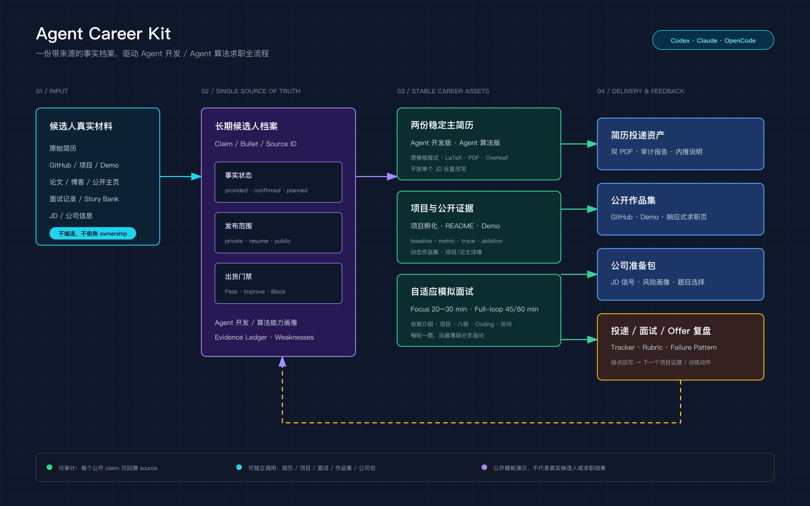
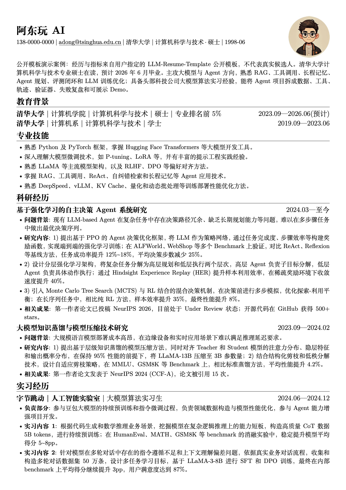
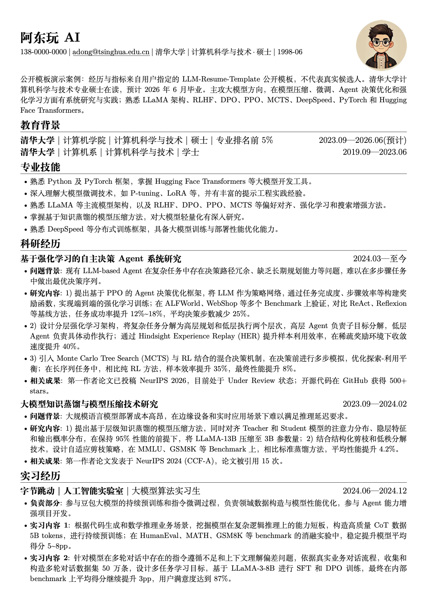
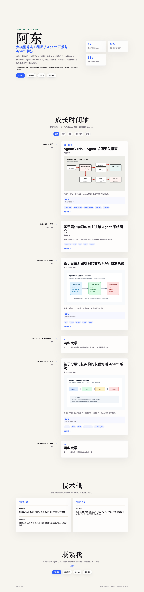
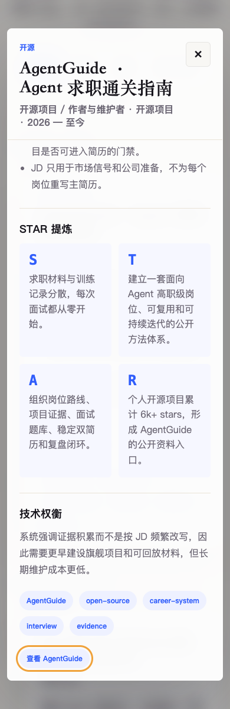
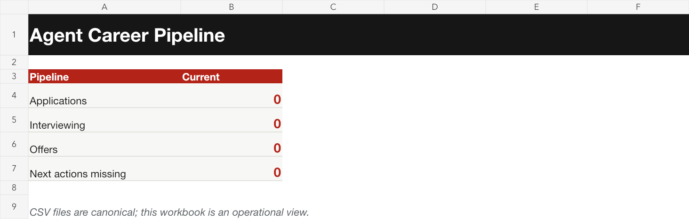

# adong-skills

一个自用的 Skills 仓库，用来沉淀可复用的 AI Agent 能力模块。  
这些 skill 主要面向 Claude Code / Codex 一类支持 Skills 机制的工具，目标是把高频工作流、人物视角和工具能力整理成可直接安装、可持续迭代的目录。

## 仓库内容

目前仓库里包含以下 skill：

### 1. andrej-karpathy-perspective

Andrej Karpathy 视角的思维型 skill。  
重点覆盖：

- AI / LLM 学习路径
- Software 2.0 / 3.0 与软件范式迁移
- human-in-the-loop 与 agent loop 设计
- from-scratch 的技术理解方法
- Karpathy 在写作、演讲、X、项目和职业决策中体现出的长期思维模式

这个 skill 是自包含的，除了 [`SKILL.md`](./andrej-karpathy-perspective/SKILL.md) 之外，还附带完整调研材料，包括：

- writings
- conversations
- expression DNA
- external views
- decisions
- timeline

目录见：
[andrej-karpathy-perspective/](./andrej-karpathy-perspective/)

### 2. github-to-skill

把 GitHub 仓库转成 skill 的工具型 skill。  
适合用来：

- 搜索合适的 GitHub 项目
- 评估仓库质量
- 基于现有仓库快速生成一个 skill 模板
- 加速把开源能力沉淀成可复用的 agent workflow

目录见：
[github-to-skill/](./github-to-skill/)

### 3. adong-wechat-writer

阿东的微信公众号长文写作 skill。
适合用来：

- 根据素材（PDF、新闻链接、语音转文字等）产出公众号长文
- 用阿东的个人风格撰写、续写、扩写文章
- 公众号内容创作全流程（选题深化 → 初稿 → 去AI味 → 发布）

触发词：写公众号、写文章、写稿子、帮我写、续写、扩写、出稿

目录见：
[adong-wechat-writer/](./adong-wechat-writer/)

### 4. adong-x-writer

阿东的 X/Twitter 推文写作 skill。
适合用来：

- 撰写单条推文或 thread 推文串
- 从公众号长文或视频脚本变形成 X 版本
- 用阿东的风格发布技术观点和行业洞察

触发词：写推文、发X、写个thread、X版本、Twitter版本

目录见：
[adong-x-writer/](./adong-x-writer/)

### 5. adong-xhs-writer

阿东的小红书图文笔记写作 skill。
适合用来：

- 撰写小红书图文笔记（300-800字 + 配图建议）
- 从公众号长文或视频脚本变形成小红书版本
- 技术干货的短内容分享

触发词：写小红书、小红书笔记、图文笔记、小红书版本

目录见：
[adong-xhs-writer/](./adong-xhs-writer/)

### 6. vibe-paper-deai

AC 级别的论文审稿与去 AI 味 skill。
适合用来：

- 以 Area Chair 视角审查 ML/AI 论文中的 LLM 生成痕迹
- 去除论文中的 AI 写作味道（overclaiming、模板化 limitation、浅层 ablation 等）
- 顶会投稿前的自检（NeurIPS、ICML、ICLR、CVPR、ACL、COLM、AAAI）
- 检测幻觉引用、公式碎片化、bullet-heavy 等常见问题

两种模式：

- **Mode A — Audit**：输出审稿报告，含 Vibe Paper Probability 和 Salvage Plan
- **Mode B — Rewrite**：在保留所有技术内容的前提下润色论文段落

目录见：
[vibe-paper-deai/](./vibe-paper-deai/)

### 7. agent-career-kit

面向高职级 Agent 开发与 Agent 算法岗位的全流程求职 Skill。




它维护一份带来源的候选人事实档案和两份稳定主简历，把下面这些环节串成长期闭环：

- 原始简历、GitHub、论文与项目材料归档
- Agent 开发 / Agent 算法能力画像
- 严格保留指定版式的双 LaTeX、PDF 与 Overleaf 简历
- 基于事实和证据的逐 bullet 简历审计
- 项目孵化、学习路线、Coding 与系统设计训练
- 单项目 `focus` 深挖与 45/60 分钟 `full-loop` 模拟面试
- 内置公开面经题库、候选人私有索引、Story Bank 与弱点回写
- GitHub README、Demo、动态个人求职页
- 公司/JD 准备包、投递、面试和 Offer 跟踪

它不会为每个 JD 重写一份主简历，也不虚构经历、指标、公司真题或 Offer 概率。确定性产物由脚本生成和验证；简历审计、项目计划和模拟面试由 Codex、Claude Code 或 OpenCode 按 Skill 工作流执行。

使用说明与单模块调用示例见：
[agent-career-kit/README.md](./agent-career-kit/README.md)

公开展示案例来自指定的 LLM-Resume-Template 模板，仅用于展示 Skill 生成效果，不代表真实候选人或求职结果。当前公开案例用于验证双视图机制，但两份 PDF 的经历主体仍高度重合，不应将其解读为已经完成理想的岗位差异化：

- [Agent 开发版 PDF](./showcase/agent-career-kit/resumes/development/main.pdf)
- [Agent 算法版 PDF](./showcase/agent-career-kit/resumes/algorithm/main.pdf)
- [动态作品集源码](./showcase/agent-career-kit/portfolio/index.html)

| Agent 开发简历 | Agent 算法简历 |
| --- | --- |
|  |  |

| 动态求职页 | 移动端项目详情 |
| --- | --- |
|  |  |



以上经历和指标来自公开模板 fixture，所有对外产物都带有 Demo 声明；真实使用必须换成候选人自己的来源和证据。

## 如何使用

### Claude Code

把需要的 skill 目录复制到 `~/.claude/skills/`：

```bash
cp -r andrej-karpathy-perspective ~/.claude/skills/
```

或：

```bash
cp -r github-to-skill ~/.claude/skills/
```

复制后，重启 Claude Code 或重新加载 skills。

### Codex / 通用 `.agents` 体系

如果你的工具使用 `.agents/skills/` 作为 skills 目录，可以复制到对应位置：

```bash
cp -r andrej-karpathy-perspective ~/.agents/skills/
```

或放到项目内的：

```bash
./.agents/skills/
```

具体以你当前 agent 工具的 skill 发现机制为准。

`agent-career-kit` 同时支持 Codex、Claude Code 与 OpenCode，详细安装命令见它自己的 [README](./agent-career-kit/README.md)。真实候选人 workspace 必须放在本仓库之外。

## 目录约定

一个标准 skill 目录通常包含：

- `SKILL.md`：主说明文件
- `references/`：补充资料、调研笔记、参考文档
- `scripts/`：可执行脚本（如果这个 skill 需要）

这也是本仓库默认采用的组织方式。

## 适合谁

这个仓库更适合下面几类人：

- 想长期积累自己的 agent 工作流
- 想把人物视角、方法论或工具能力沉淀成 skill
- 想让 AI Agent 在不同项目里复用同一套能力
- 想把“提示词”升级成“可维护的能力模块”

## 贡献方式

这是一个偏个人化的 skills 仓库，但结构是开放的。  
如果你要 fork 后自己维护，建议：

1. 保持 skill 目录自包含
2. 把来源和参考材料放进 `references/`
3. 让 `SKILL.md` 既能被人读，也能被 agent 稳定触发
4. 尽量避免把一次性的 prompt 直接塞进 skill

## License

仓库原创代码与内容采用 MIT License。第三方材料按各自许可证分发；`agent-career-kit` 使用的简历 class、模板来源和修改说明见 [THIRD_PARTY_NOTICES.md](./agent-career-kit/THIRD_PARTY_NOTICES.md)，公开 showcase 的 CC BY 4.0 归属见 [showcase 说明](./showcase/agent-career-kit/README.md)。
